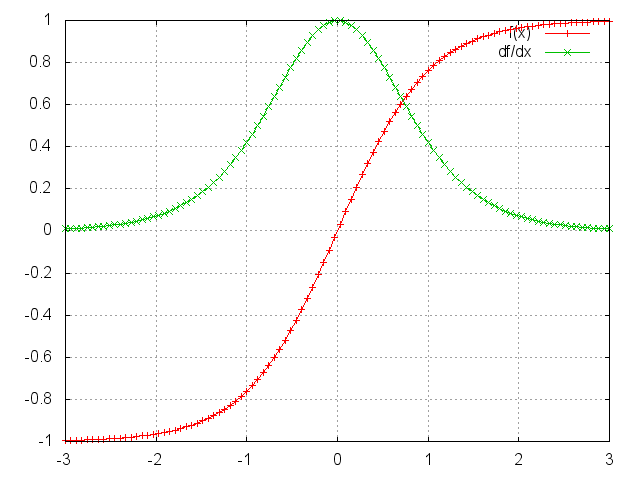
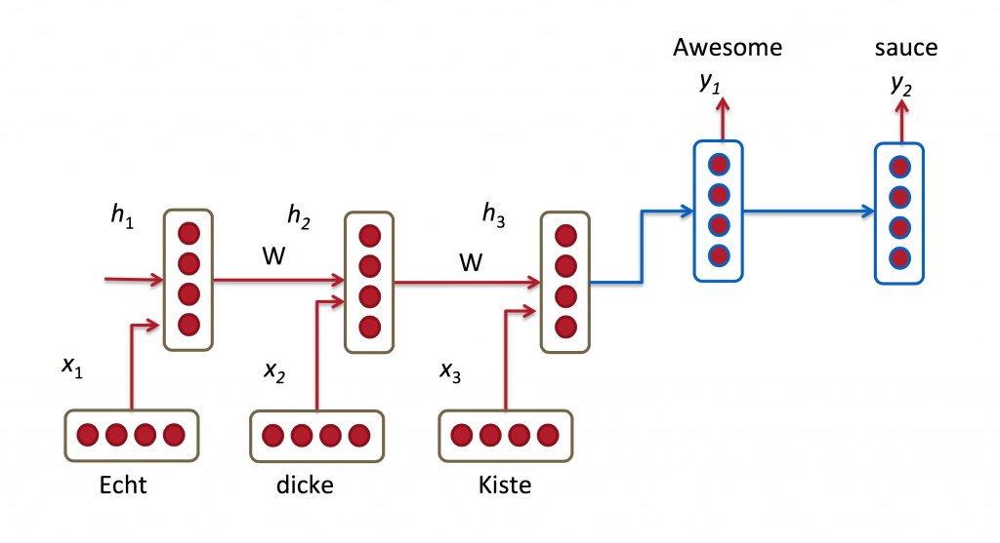

% Course notes about RNN

# On parameter sharing

## Basic approach: the feed-forward net

- Requires lots of parameters:
Ex: input image 100x100 = 10000 input neurons
if 100 hidden neurons = 1M parameters

Is it a problem ? Yes and no

## Theoretical results
- overparameterized networks have all their local optima close to global optima
- more parameters => more overfitting => less generalization

## Practical rules of thumbs
- #parms may be greater or smaller than #ex, but they should be in the same order of magnitude !!
Ex: 10k vs. 10 is bad

So for images, this may quickly become a problem:
camera have 10M pixels => with 100 hidden neurons => 1G parameters, requires lots of examples !

Another issue: exploit the intrinsic structure of the input:
Ex: for image, invariance by translation and rotation

# ConvNet

Better solution = convnets = share parameters across segments of the input

ConvNet capture info from local contexts
They can be stacked to increase the size of the local context from which thye capture info => receptive field
But they are inherently *local*

# Recurrence

Another type of data, another structure: time series

- Strong dependence to the previous samples: Ex: meteo temp
- dependence decrease over time

Classical models: autoregressive models, Markov models ==> Markov assumption

DL: RNN

Principle:

- Use the same parameters at every timestep => small model
- transmits a memory (vector) from previous sample => recurrence

It exploits a *global* context => stronger than Markov models

## Basic RNN

$s_t=f(Ux_t+Ws_{t-1})$

Training: BPTT

Difference with standard BP = gradients at every timestep are summed

{ width=300 }

$$\frac{\partial E_3}{\partial W} = \sum_{k=0}^3 \frac{\partial E_3}{\partial \hat y_3} \frac{\partial \hat y_3}{\partial s_3} \left( \prod_{j=k+1}^3 \frac {\partial s_j}{\partial s_{j-1}} \right) \frac{\partial s_k}{\partial W}$$

## Vanishing gradient

### MLP case

$$ l_1 = U \cdot X$$
$$ h_1 = \text{tanh}(l_1)$$
$$ l_2 = V \cdot h_1$$
$$ y = \text{tanh}(l_2)$$
$$\frac {\partial E_y}{\partial l_1} = \frac{\partial E_y}{\partial y}\frac{\partial y}{\partial l_2}\frac{\partial l_2}{\partial h_1}\frac{\partial h_1}{\partial l_1}$$

Derivative of the tanh:

{ width=250 }

Multiplying by numbers < 1 decreases the magnitude, layer after layer.

### Solutions to vanishing gradient

- Careful init of parameters
- Careful tuning of regularization
- Use ReLU activations
- Use GRU or LSTM recurrent cells

- Practical consequences:
  - 20 steps maximum for basic RNN, 100 steps maximum for LSTM
  - Truncated BP at 100 steps

### LSTM

$s_{t+1} = f(s_t,x_t)$

with 3 gates in $f$ to let some information pass through without activation.

Video: [vanishing gradient in LSTM](../coursML2018/gradient.mp4)

### RNN common extensions

- Stacked RNNs
- Bi-directional
- Attention (see next)

### Models that use RNNs

- NN-LM
- Seq2Seq
- Key-Value Memory Networks
- Neural Turing Machine
- Transformer-XL
- …

# Exercice RNN

- See [https://members.loria.fr/CCerisara/exosols/rnnexo/](https://members.loria.fr/CCerisara/exosols/rnnexo/)

# Other tutorials

http://www.wildml.com/2015/09/recurrent-neural-networks-tutorial-part-1-introduction-to-rnns/

http://karpathy.github.io/2015/05/21/rnn-effectiveness/

# Seq2seq

- The RNN generates 1 output for a given history
- We may want to generate a (varying-length) sequence of outputs for a given history:
  - Chatbot: User turn -> System turn
  - Question-Answering: question -> answer
  - Translation: English sentence -> French sentence
  - ...

{ width=450 }

- It is a kind of "Encoder-Decoder" architecture
- Trick in the decoder RNN:
  - reinject the output at time $t$ into the input at time $t+1$
  - when the symbol \</s\> is generated, stop.
- Training:
  - The Seq2seq is trained end-to-end
  - Teacher forcing: use the gold output at every timestep in the decoder
  - But this creates a mismatch between training and testing
  - Professor forcing:

{ width=450 }

# Attention

- Issue in RNN = hidden vector gives more importance to the most recent timestep
- We may prefer content- vs. recency-based importance
  - "The ball flew quickly as everyone was looking at it": topic ?

- Let $q$ contains partial interesting information
- Let be given a "bank of vectors $z_i$": one of them is related to $q$
- Compute the distance between $q$ and every $z_i$: $q \cdot z_i$
- Normalize with softmax: $\alpha_i = Softmax (q \cdot z_i)$
- Compute a new summary vector: $z = \sum_i \alpha_i z_i$

Ex with Seq2seq:
{ width=200 }

- $q$ = current decoder hidden state
- $z_i$ = encoder hidden states
- $z$ is used to compute the next decoder step

- Everything is as always trained end-to-end
- Attention is **very useful** to show which parts of the input is the most relevant at a given timestep

# Transformer

- Attention: Query-key-values
  - Bank may contain pairs of vectors (key, value)
  - The query $q$ is compared to every key; the corresponding value is returned
  - Basis of Key-value memory networks
- Multi-head attention:

{ width=300 }

- Self-attention: Q=K=V=words X
- Transformer:

{ width=300 }

- No recurrence !
- Used in all recent deep learning models

